# Языки программирования
## Лабораторная работа 1
### Задание 1 **(4)**
*Составьте глоссарий из определений лекции. Проверка отчета будет включать 
проверку знания определений*
* **Исходный код.** Текст программы на языке программирования
* **Объектный код.** Промежуточный файл от исходного кода до исполняемого.
* **Исполняемый код.** Файл, содержащий набор инструкций, которая 
может быть выполнена процессором под управлением определённой
операционной системы.
* **Ассемблер** - ЯП низкого уровня, в котором каждая инструкция процессора
написана в текстовом виде.
* **Виртуальная машина** - средство описания семантики ЯП.
* **Стандарт ЯП** - документ, описывающий ЯП и тем самым устанавливающий его "стандарты".
* **Транслятор** - средство, переводящее текст программы с одного языка на другой.
* **Компилятор** - транслятор, переводящий ЯП в машинный код для дальнейшего исполнения.
* **Интерпретатор** - транслятор, читающий и исполняющий код по одной строке.
* **Псевдокомпилятор** - транслятор, создающее промежуточный вариант из исходного
кода. Состоит из инструкций, близких к машинному коду.
* **Компилирующий интерпретатор** - транслятор, переводящий текст программы непосредственно
после запуска.
* **REPL-интерпретатор** - средство, работающая в цикле чтения-вычисления-печати. В режиме
диалога он считывает эту конструкцию, транслирует и исполняет её.
* **Единица трансляции** - минимальный фрагмент кода, который может быть транслирован вне
зависимости от остального кода.
* **Ошибка времени выполнения** - ошибка использования ЯП, обнаруживаемое во время исполнения.
* **Непредсказуемое поведение** - ошибки, которые могут проявляться в непредсказуемое время в
непредсказуемом виде.
* **Неопределённое поведение** - поведение программы, которое может выдавать абсолютно разные
результаты при использовании различных трансляторов.
* **Препроцессинг** - начальный этап трансляции программы.
* **Сборка** - финальный этап трансляции в исполняемый файл.

[//]: # (### Задание 2 **&#40;1&#41;**)

[//]: # (*Установите файловый менеджер* **Far Manager**. *Официальный сайт*)

[//]: # ()
[//]: # (<https://farmanager.com/download.php?l=ru>.)

[//]: # ()
[//]: # (*Изучите его основные возможности по работе с файлами: копирование, переименование, удаление, )

[//]: # (запуск, редактирование, просмотр, создание файлов и папок, использование командной строки. )

[//]: # (Потренируйтесь в их использовании. Для проверки вам будет дано задание на работу с файлами)

[//]: # (с ограничением на время выполнения. Обратите внимание, что все задания требуется выполнить )

[//]: # (на клавиатуре без использования мыши.*)

[//]: # ()
[//]: # (*В отчет запишите справку по горячим клавишам Far Manager, которые вы использовали.*)

[//]: # ()
[//]: # (* **Alt+F1** Выбор диска на левой панели)

[//]: # (* ...)

### Задание 3 **(1)**
*Установите компилятор* **GNU C++** в составе среды программирования **code::blocks**.

*Официальный сайт*

<https://www.codeblocks.org/downloads/binaries> 

*Обратите внимание, что вам нужна сборка, в состав которой входит* **mingw**, *например*, **codeblocks-25.03mingw-setup.exe**.

*Найдите папку с бинарными файлами, в которой хранится компилятор С++ (файл* **g++.exe**).
*Например, она может называться* **D:\Program Files (x86)\CodeBlocks\MinGW\bin**.

*Проверьте, что эта папка указана в настройках путей Windows. Пункт настроек:* 

**Изменение переменных среды текущего пользователя**. 

*В переменной* **path** *должен быть указан путь к папке с компилятором С++.*

*Используя файловый менеджер создайте папку с проектом на С++, в нем запишите программу для сложения
двух чисел, выполните ее трансляцию из командной строки, запустите и убедитесь в ее работоспособности.
При проверке эту часть задания потребуется выполнить за две минуты без использования мыши.*

*В отчет вставьте скриншот с трансляцией программы из командной строки и ее запуском и работой.*

[//]: # (Пример )

[//]: # ()
[//]: # (![Скриншот]&#40;03.png&#41;)

---

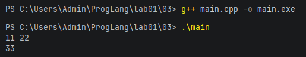

### Задание 4. **(2)**

*В этом задании необходимо записать на С++ программу, состоящую из четырех модулей. Первый модуль 
должен содержать функцию* **message(std::string)** *для вывода произвольного сообщения на консоль.*

```
#include <string>
void message(std::string mes) {
    std::cout << mes << std::endl;
}
```
*Второй модуль должен содержать функцию* **hello()** *для вывода сообщения* **hello world!!!** *и использовать
функцию* **message**.

*Третий модуль аналогично второму должен содержать должен содержать функцию* **goodbye()** *для вывода сообщения* **goodbye world!!!**.

*Четвертый модуль должен содержать функцию* **main** *и вызывать функции* **hello** *и* **goodbye**.

* Допишите заголовочные файлы.
* Создайте объектные файлы для каждой из единиц трансляции. Каждый файл надо получить отдельной командой.
* Выполните сборку программы из объектных файлов и проверьте ее работоспособность.
* Проверьте, можно ли выполнить компиляцию одного файла, если другой содержит синтаксическую ошибку.
* Проверьте, что произойдет при сборке, если один из объектных файлов будет потерян.

*В отчет вставьте скриншоты работы в командной строке и пояснения к заданиям*

*Все файлы с исходными кодами надо сохранить в папке 04*

---

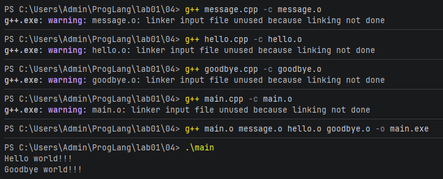  
*Трансляция исходного кода в промежуточные O и их сборка в исполняемый файл*

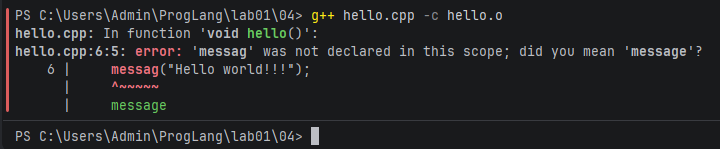
При синтаксической ошибке компиляция даже одного файла невозможна.

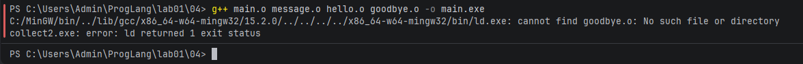  

[//]: # (### Задание 5 **&#40;2&#41;**)

[//]: # (*Выполните задание аналогичное предыдущему на языке Java. Программа должна содержать четыре класса в четырех файлах.*)

[//]: # ()
[//]: # (### Задание 6 **&#40;2&#41;**)

[//]: # (*Выполните задание аналогичное предыдущему на языке python. Программа должна содержать четыре функции в четырех файлах.*)

[//]: # ()
[//]: # (*Далее записаны функции в двух файлах. Инструкция* **import** *импортирует функцию из другого модуля.*)

[//]: # ()
[//]: # (**message.py**)

[//]: # (```)

[//]: # (def message&#40;mes&#41;:)

[//]: # (   print&#40;mes&#41;)

[//]: # (```)

[//]: # (**hello.py**)

[//]: # (```)

[//]: # (from message import message)

[//]: # (def hello&#40;&#41;:)

[//]: # (   message&#40;'Hello world!!!'&#41;)

[//]: # (```)

### Задание 7
*Запишите makefile для сборки программы на С++ из задания на раздельную трансляцию.*

*Обратите внимание, что целью выполнения задания является не написание собственно makefile, а изучение зависимостей в единицах трансляции в написанных программах
утилита* **make** *имеет достаточно удобные средства для автоматического поиска зависимостей, но в данном случае пользоваться ими нельзя. Весь файл должен быть записан
только с использованием базового синтаксиса* 

```
цель : зависимости
    команда
```

* Выполните сборку программы из объектных файлов и проверьте ее работоспособность.
* Проверьте какие команды из makefile выполняются при изменении каждого из исходных файлов.
* Проверьте, что произойдет при сборке, если один из объектных или исполняемых файлов будет потерян.
* Для проверки правильности указания зависимостей измените прототип функции **message** на
```
void message(char* mes);
```
* Выполните сборку проекта и проверьте работоспособность программы.


*В отчет вставьте пояснения о работе make и скриншоты работы в командной строке.*

*Сам makefile также надо сохранить в папке 04*

---

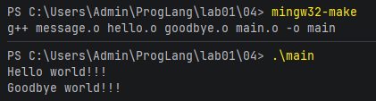  

При отсутствующем объектном файле *make* просто его перекомпилирует. Однако при отсутствующем
исходнике компиляция провалится.  
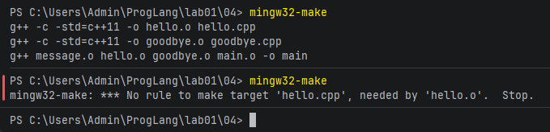  

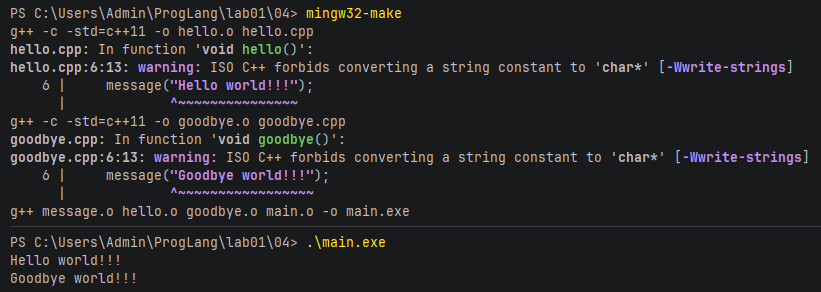  

### Задание 8
*Проверьте различные синтаксические конструкции языка С++. Каждая из них появилась в определенном
стандарте С++. Попытайтесь выполнить трансляцию каждого файла и выясните в стандарте каких годов
были реализованы эти конструкции. Следует проверить стандарты 1998, 2003, 2011, 2014 и 2017 годов.*

#### 1. Использование вектора
```
#include <vector>
#include <iostream>
int main() {
   std::vector<int> v(5);
   for (int i=0;i<5;i++)
       std::cout << v[i]<<' ';
   return 0;
}
```
#### 2. Цикл по коллекции.
*Замените цикл для вывода вектора*
```
   for (int x:v)
       std::cout << x << ' ';
```
#### 3. Вывод типа по инициализатору
*В цикле по коллекции используйте автоматический вывод типа для переменной x, используя ключевое слово* **auto**.

#### 4. Инициализация списком
*Добавьте в строку создания вектора инициализацию списком.*
```
   std::vector<int> v = {1, 2, 3, 4, 5};
```

#### 5. Сепараторы для групп разрядов.
*Добавьте в список инициализации длинное число с сепараторами для групп разрядов.*
```
   std::vector<int> v = {1, 2, 3, 4, 5, 1'000'000'000};
```

#### 6. Вывод типа по конструктору. 
*Уберите из строки создания вектора его тип.*
```
   std::vector v = {1, 2, 3, 4, 5};
```

*В отчет вставьте пояснения о стандартах С++ и используемых возможностях языка*.

*Все примеры программ надо сохранить в папке 08*

---

Первый файл успешно компилируется со стандартом C++98.  

Второй, третий и четвёртый файлы компилируются только начиная со стандарта C++11. Соответственно
такие функции, как расширенный цикл, автоматический тип и инициализация списком доступны только
начиная с этого стандарта.  
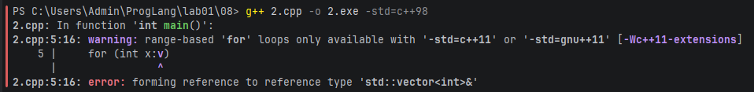  
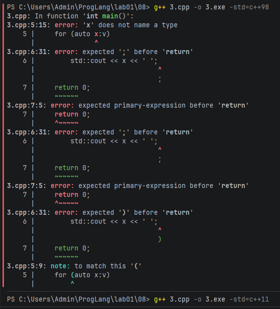  
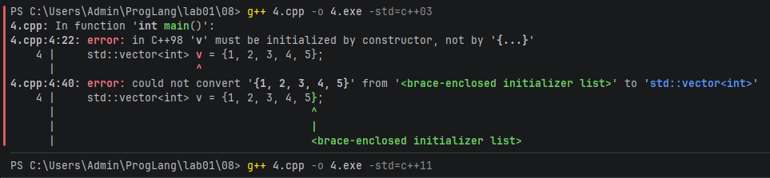  

Пятый файл уже компилируется только начиная с C++14. Соответственно возможность добавления
сепараторов добавлена начиная с этого стандарта.  
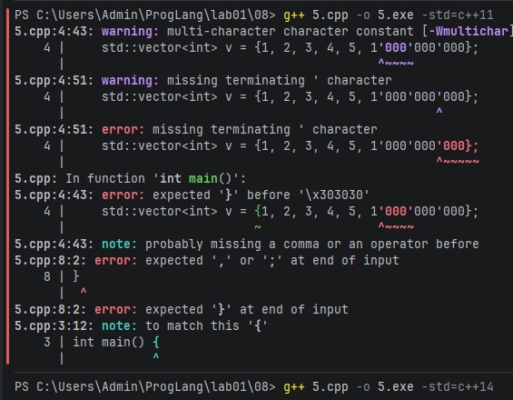  

Ну и шестой файл компилируется только начиная с C++17.  
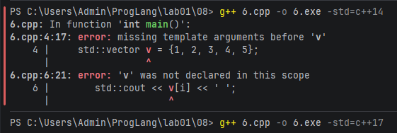

### Задание 9 **(3)**

*Запишите следующую программу на языке С++ и выполните ее трансляцию в 
ассемблерные файлы с уровнями оптимизации* **O0**, **O1**, **O2**.
```
#include <iostream>
int main() {
   int x, s = 0;
   std::cin >> x;
   for (int i=0; i<123; i++) 
      s += x ;
   std::cout << s;
   return 0;
}
```
*Сохраните эти файлы и сравните код для функции main. Он начинается с декларации* **main:***. Сравните, как будет работать код программы
с разными уровнями оптимизации.*

*В отчет запишите различающиеся фрагменты ассемблерного кода с пояснениями.*

---

***TODO***