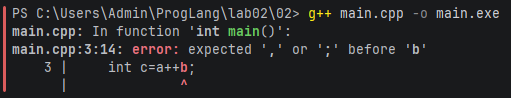
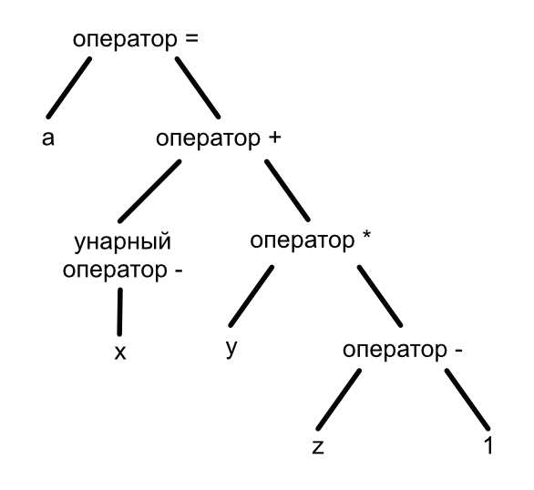

# Языки программирования
## Лабораторная работа 2
### Задание 1 **(2)**
**С++**: `int`, `float`, `struct`, `if`, `else`  
**Java**: `public`, `static`, `package`, `switch`, `case`  
**Python**: `def`, `for`, `return`, `class`, `import`

**Создать переменные с именами ключевых слов невозможно**, поскольку они зарезервированы синтаксисом языка
и при их использовании появится синтаксическая ошибка.

### Задание 2 **(2)**
  
При запуске Python файла никаких ошибок не выводится.

---

```c++
int main() {
   // a, b - идентификаторы; = - оператор присваивания; 1, 2 - числовые литералы
   int a=1, b=2;
   // c, a, b - идентификаторы; = - оператор присваивания; ++ - оператор инкремента
   int c=a++b;
   return 0;  
}
```
При двух плюсах подряд (++) C++ собирает их как один токен (оператор инкремента) и по итогу
выражение считывается как `int c = a++ b;`. После оператора инкремента компилятор ожидает разделитель,
однако вместо этого видит переменную b.

```python
# a - идентификатор; = - оператор присваивания; 1 - числовой литерал
a=1
# b - идентификатор; = - оператор присваивания; 2 - числовой литерал
b=2
# c, a, b - идентификаторы; = - оператор присваивания; + - оператор сложения; + - унарный оператор
c=a++b
```
В Python нет отдельного токена ++. Соответственно интерпретатор делит их как оператор сложения и
унарный оператор и по итогу получается `int c = a + (+b);`.


### Задание 3 **(2)**
Результат будет равен 3.

```c++
int main() {
   // a, b - идентификаторы; = - оператор присваивания; 1, 2 - цифровые литералы
   int a=1, b=2;
   // c, a, b - идентификаторы; = - оператор присваивания; ++ - оператор инкремента; + - оператор присваивания
   int c=a+++b;
   return 0; 
}
```
В этом случае получается `int c = (a++) + b;`. Префиксный инкремент увеличивает число только уже после вычисления, соответственно вместо 2+2 получается 1+2.

```c++
int c=a + ++b;
```
В этом случае результатом уже будет 4, т.к. постфиксный инкремент увеличивает число уже до вычисления, тем самым получается вычисление 1+3.

### Задание 4 **(2)**
Квадратные скобки почти всегда являются оператором индексации (взятие элемента cо списка по индексу).  
Круглые скобки становятся оператором вызова функции или оператором приведения типов.
#### Примеры, где круглые скобки являются оператором
```c++
// Оператор вызова функции без аргументов
print_message();
// Оператор вызова функции с аргументами a и b
int res = add(a, b);
```

```c++
double pi = 3.14;
// Оператор явного приведения типа
int x = (int)pi;
```

#### Примеры, где круглые скобки НЕ являются оператором

```c++
// Порядок вычисления
int x = (a + b) * c;
```

```c++
// Объявление параметров
int my_func(a, b){
    return a + b;
}
```

### Задание 5 **(3)**
```python
print(*map(sum,zip(
    *[map(int,input().split()) for i in (1,2,3)]
    )))
```

**Ключевые слова**: `for`, `in`  
**Идентификаторы**: `print`, `map`, `sum`, `sip`, `int`, `input`, `split`, `i`  
**Литералы**: `1`, `2`, `3`  
**Операторы**: `*`, `.`

Переменные: `i` (временная переменная для цикла)  
Имена функций: `print`, `map`, `sum`, `sip`, `int`, `input`  
Имена методов: `split`

---

- `input()`
- `split()`
- `map(int, ...)`
- `map(sum, ...)`
- `zip()`
- `print()`

---

1. Ввод разделяется на три прохода (цикла). `split()` отделяет значения, убирая пробелы;
2. `map(int, ...)` затаскивает эти значения в списки (получается три списка в одном);
3. Звёздочка `*` «вынимает» эти 3 списка из общего списка и передает их в `zip` как 3 отдельных аргумента;
4. `zip()` занимается "транспонированием" списков;
5. `map(sum, ...)` берет функцию `sum` и суммирует значения с разных списков, выкладывая полученные значения в один список;
6. `print()` со звёздочкой `*` выводит значения с пробелами вместо запятых.

### Задание 6 **(2)** 
```
cout<<"Hello /* Это комментарий */ world";
```

```
// /*
 Это комментарий
*/
```

```
/* Я комментирую программы /* комментарий */ */
```

```
// Я комментирую программы /* комментарий */  
```

```
/* Я комментирую свои программы
// Это комментарий до конца строки */
*/
```

---

**Второй вариант неверен.** `//` применяется только к одной строке (однострочный комментарий): `/*` помечается как комментарий, остальное выходит наружу.  
**Третий и пятый варианты также неверны**, поскольку первая по очереди `*/` закрывает комментарий, а вторая выходит наружу. Если её не убрать, на выходе получится `Invalid syntax`.

В первом варианте знаки комментария внутри текстового литерала считываются просто как символы и выводятся как обычно.  
В четвёртом варианте знак `//` означает, что комментарий распространяется на ВСЮ строку (до символа перехода на новую строку), соответственно знаки многострочного комментария игнорируются.

### Задание 7 **(4)**
Как видно из правил, есть 4 инструкции циклов.
Первый вид - цикл while, который соответствует строке правила `while ( condition ) statement`.

* Формат записи (по правилу): ключевое слово **"while"**, в круглых скобках условие **"condition"**,  
далее инструкция **"statement"**.
* Пока (условие верное) {выполнять инструкцию до тех пор, пока условие не станет ложным}

*Пример фрагмента программы.*
```c++
int x = 1;
while (x<1000) {
  cout << x;
  x *= 2;
}
```

Второй вид - цикл do-while, который соответствует строке правила `do statement while ( expression ) ;`.

* Формат записи (по правилу): ключевое слово **"do"**, инструкция **"statement"**, ключевое слово **"while"**
и в круглых скобках условие **"expression"**.
* Сначала выполняется инструкция, затем проверяется условие. Если оно истинно, цикл повторяется. Инструкция выполнится хотя бы один раз.

*Пример фрагмента программы.*
```c++
int x = 1;
do {
    cout << x;
    x *= 2;
} while (x < 1000);
```

Третий вид - классический цикл for, который соответствует строке правила `for ( init-statement condition_opt ; expression_opt ) statement`.

* Формат записи (по правилу): ключевое слово **"for"**, в круглых скобках начальное значение (объявление временной переменной) цикла **"init-statement"**, условие **"condition_opt"** и шаг цикла **"expression_opt"**, далее инструкция **"statement"**.
* Выполняет инструкцию инициализации (например, объявление счетчика), затем проверяет условие перед каждым шагом. Если условие истинно, выполняется основная инструкция, а после него вычисляется выражение итерации (например, шаг инкремента).

*Пример фрагмента программы.*
```c++
for (int i = 0; i < 10; i++) {
    cout << i;
}
```
Четвёртый вид - диапазонный цикл for, который соответствует строке правила `for ( for-range-declaration : for-range-initializer ) statement`.

* Формат записи (по правилу): ключевое слово **"for"**, в круглых скобках объявление переменной **"for-range-declaration"** и инициализируемый диапазон **"for-range-initializer"**, далее инструкция **"statement"**.
* Последовательно перебирает каждый элемент из диапазона, последовательно связывая текущий элемент с объявленной переменной и выполняя инструкцию для каждого элемента.

*Пример фрагмента программы.*
```c++
vector nums = {1, 2, 3, 4};
for (int n : nums) {
    cout << n;
}
```

### Задание 8 **(3)**
```c++
int main() {
    int a,x,y,z;
    cin >> x >> y >> z;
    a = -x+y*(z-1);
}
```




